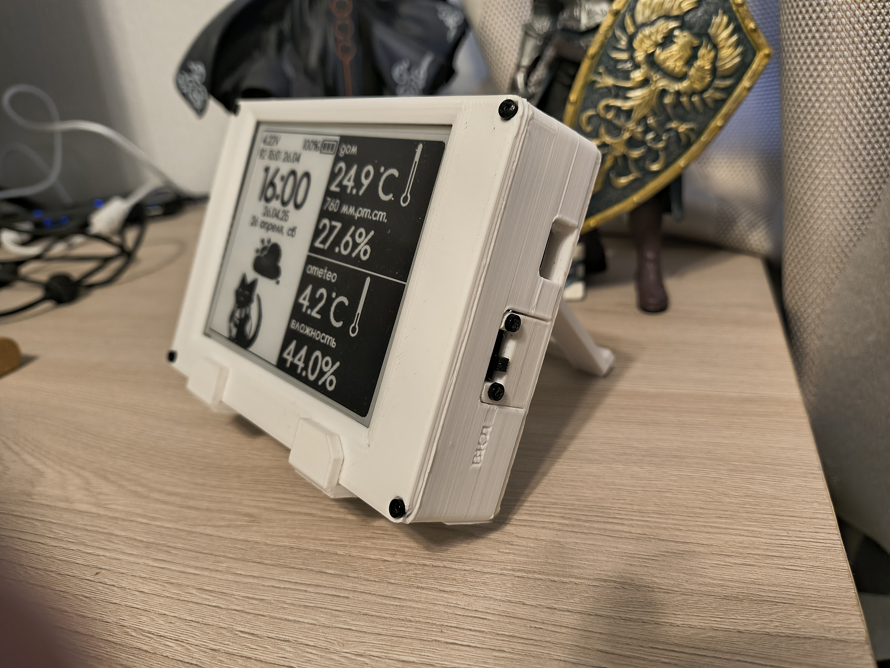
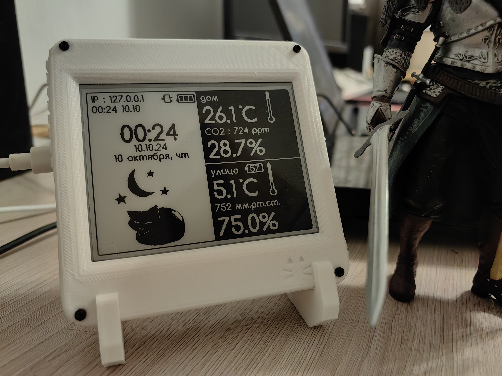

## Weather station *Volna 2BW42* firmware

[Project homepage](https://42volna.ru/)

A weather station project with a monochrome E-Ink display

- E-Ink displays 4.2' (400x300), 1.5' (200x200)  
  (Waveshare, WeAct, Heltec or equivalents - [List of supported displays](https://42volna.ru/displays/))
- Temperature and humidity sensor - BME280; Optional : CO2 - SCD41 sensor, Temp - DS18B20 sensor;
- Arduino Framework (C++, PlatformIO); compatible with **ESP8266** and **ESP32**
- Create and upload your own design through the web panel
- Autonomous mode - the device wakes up every 10 minutes (default) and updates the screen. A 2000 mAh 18650 battery lasts for several months
- Partial update mode for the clock area - every 1-2 minutes
- Sensor data transmission via MQTT, receiving data from an external sensor through **Home Assistant**, **Domoticz**, **Open-Meteo** or from **OpenWeather** (less recomended) API
- UI Language : English, Russian, Japanese, German (any other translations are welcome)
- Settings panel language : English, Russian

# How to build

- Open project in PlatformIO (subfolder Volna42)
- Setup pinouts and defines in UserDefines.h according to your display & overall setup (battery sensor, i2c pins)
- Setup settings in UserSetting.h
- Build!
- First setup from web-panel (access by displayed IP) 

Default [ESP8266 D1 Mini](https://docs.platformio.org/en/latest/boards/espressif8266/d1_mini_lite.html) config - **platformio.esp8266.ini**  
Default [ESP32-S3-DEVKITC-1](https://docs.platformio.org/en/latest/boards/espressif32/esp32-s3-devkitc-1.html) config - **platformio.esp32.ini**

Default settings (UserSetting.h)

WiFi Access Point (Turned On if WiFi settings not specified)  
Name : VOLNA42-EINK  
Password : volnaaccess  
Web-interface : http://192.168.1.1/  
Firmware Update page : http://192.168.1.1/update (login : admin, password : admin)  

[Full documentation & extended build instructions](https://42volna.ru/instructions/)  
[Schematics](https://42volna.ru/scheme/)

# Developer tools 

[1-bit Image Converter & Icon Editor](https://42volna.ru/tools/glypheditor)  
[Fonts generator](https://42volna.ru/tools/fontconverter)  
[Tools GitHub Repo](https://github.com/NC22/Volna42BW-Tools)  

# Links

[Cases examples](https://42volna.ru/boxes/)  
[How to setup connection with external sensor](https://42volna.ru/instructions/external)  
[How to setup sending data to mqtt broker](https://42volna.ru/instructions/mqtt)  
[Trobleshooting](https://42volna.ru/instructions/issues)  

# Photos

# License

[GNU General Public License v3](http://www.gnu.org/licenses/gpl.html)